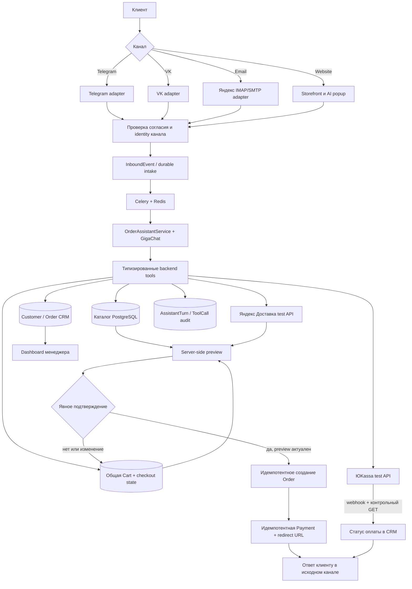
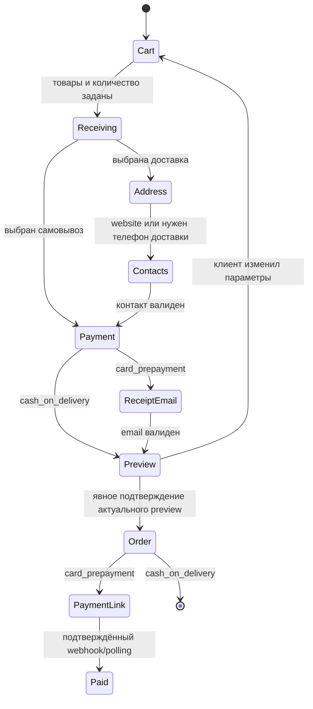

# Data flow AI-системы WebMarket

Версия: 1.0
Дата актуализации: 07.09.2026
Статус: соответствует реализованному MVP

## 1. Сквозной поток заказа

## 2. Границы ответственности LLM

GigaChat понимает естественный язык, контекст реплики и выбирает разрешённый
инструмент. Модель не имеет доступа к ORM/SQL и не является источником сведений о
товарах, ценах, корзине, клиенте, доставке, заказах или оплате.

Типизированные инструменты получают факты из backend: поиск активного каталога,
чтение и изменение корзины, параметры получения и оплаты, контакты, preview,
историю/повтор заказа, отмену, подтверждение и ссылку оплаты. Все аргументы проходят
Pydantic-валидацию, mutating-вызовы защищены ключами идемпотентности и аудитом.

## 3. Состояние незавершённого оформления

Ручной интерфейс и AI-ассистент читают и изменяют одну активную корзину данного
канала. При возобновлении устаревшей корзины backend заново проверяет активность,
минимальное количество и текущую цену товара; историческая цена используется только
в уже созданном заказе.

## 4. Идентификация и персональные данные

- Telegram/VK: устойчивый ID платформы; телефон собирается штатным сценарием.
- Email: нормализованный адрес отправителя является identity канала.
- Website без регистрации: сессия нужна только для изоляции корзины/диалога;
  CRM-клиент определяется по данным, явно указанным при оформлении.
- Согласие хранится append-only событием вместе с неизменяемыми версиями Политики и
  Согласия. Новый website AI-диалог имеет отдельный scope согласия.
- Конфликт контактов между карточками не блокирует заказ и передаётся менеджеру.

## 5. Отказоустойчивость и аудит

- Входные события, заказ и платёж создаются идемпотентно.
- Ошибка LLM, доставки или оплаты сохраняется и не заменяется выдуманным результатом.
- Фактический ответ ассистента сохраняется неизменно в `AssistantMessage`.
- Каждый вызов инструмента и его результат фиксируются в `AssistantToolCall` без
  сохранения секретов и платёжных реквизитов.
- Пропущенный webhook ЮKassa компенсируется периодической сверкой незавершённых
  платежей с API провайдера.
